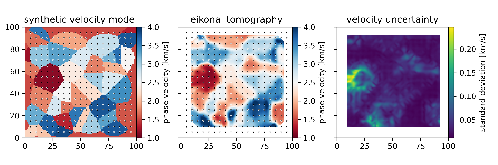

# Eikonal Tomography - Synthetic Demonstration

The Eikonal equation relates local phase velocity c with the local gradient of travel times ∇T: ∇T = 1/c.

When a wave field is densely sampled, sufficiently dense maps of travel times and thus travel time gradients can be computed. This allows to retrieve phase velocity maps without the need for costly inversion algorithms. In seismology, this has been applied in some cases where spatially homogeneous and sufficiently dense spacing of stations was available. There, seismologists usually exploit the ambient seismic field to compute *estimated Green's Functions* between station-pairs from cross-correlations of the ambient seismic field to measure seismic wave velocities. This approach can provide the spatially and azimuthally dense sampling necessary for Eikonal tomography to function (e.g., Lin et al. 2009, de Ridder et al. 2015).

This repository is a synthetic demonstration of that principle. For this, a velocity model and synthetic station locations are defined. Travel times between those stations are estimated using the Fast Marching Method (FMM). From these measured travel times, interpolated maps of travel time are generated. Gradients are computed for these maps, and the final velocity model is the mean model from all virtual source stations. The error is the standard deviation of those models.

## Requirements

* python (tested on 3.9)
* numpy, scipy, matplotlib
* tqdm (*because the measurement of travel times can take a long time*)
* [scikit-fmm](https://github.com/scikit-fmm/scikit-fmm)

## References

Lin, F.C., Ritzwoller, M.H., Snieder, R. (2009) Eikonal tomography: surface wave tomography by phase front tracking across a regional broad-band seismic array. <i>Geophysical Journal International</i>, <b>177</b>, 1091–1110. doi:10.1111/j.1365-246X.2009.04105.x

Ridder, S.A.L. de, Biondi, B.L. &#38; Nichols, D. (2015) Elliptical-anisotropic eikonal phase velocity tomography. <i>Geophysical Research Letters</i>, <b>42</b>, 758–764. doi:10.1002/(ISSN)1944-8007